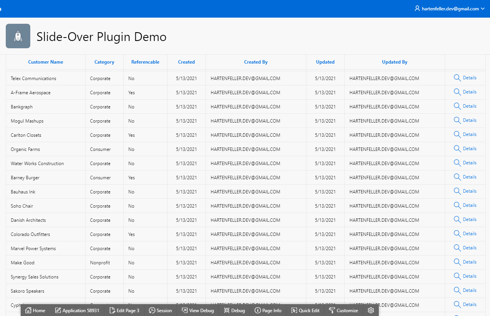

# Oracle APEX Slideover Plug-In

Region Plug-In for content that slides in from the side.



Demo: https://apex.oracle.com/pls/apex/hartenfeller_dev/r/slide-over-plugin-demo/slideover-demo

Features:

- Directions right and left
- Full width on phones
- No animations for reduced motion settings
- Stylable

Internet Explorer is not supported!

## Usage

[YouTube Tutorial](https://www.youtube.com/watch?v=sU8LlBcXP4I)

### Import Plug-In

- [Download Plug-In](https://github.com/phartenfeller/apex-slide-over-plugin/releases/download/v1.1/region_type_plugin_dev_hartenfeller_slideover.sql)
- Import the downloaded SQL file in your APEX App in the shared components -> Plug-ins -> import

### Region

- Create a region of the type "Slideover [Plug-In]"
- Change Layout -> Position to "Inline Dialogs"
- Put your desired child regions into the created plug-in region
- Change settings under the region attributes (optional)

### Open a slideover

Dynamic Action -> Open Region -> Select your region

Or with JavaScript:

```js
apex.region('regionStaticID').open();
apex.region('regionStaticID').close();
```

### Change title dynamically

```js
apex.region('staticId').setTitle('New Title');
```

## Styling

### APEX 21.1

For APEX 21.1 it uses the CSS variables by universal theme. The slideover will fit nicely into your app.

You can still overwrite this with custom CSS. 

### Custom CSS

```css
/* Dark background to draw attention to the slideover */
slide-over::part(lay-over) {
  background-color: rgba(90, 41, 41, 0.6);
}

/* The layover itself */
slide-over::part(slide-over) {
  background-color: #ffffd2;
}

/* Header of the layover */
slide-over::part(slide-header-text) {
  font-weight: 300;
  color: purple;
}

/* Close button */
slide-over::part(close-button) {
  color: purple;
}

/* Set close button focus outline */
slide-over::part(close-button):focus {
  border-color: pink;
}
```
